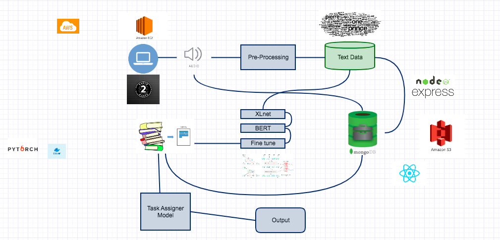

Members:
1. Shriya Vanvari
2. Amit Garg
3. Shubham Kumar
4. Maaz Sirkhot

# Smart MOM (Minutes of Meeting)

## Description: 
This model will record the meetings either through a recorder or as an Alexa Skill and convert the audio to text. The meeting conversation will be classified into a proper conversation. This conversation will be passed through various NLP algorithms to create a summary and generate minutes of meeting automatically. These minutes of meeting will be send over to all stakeholders especially the ones who couldn't attend the meeting. 

# Abstract:

This is a smart assistant to help user go through minutes of meeting in such a way that user gets meeting summary generated by a tool that picks up only relevant information to agenda of meeting and discards any unnecessary information. This model is most useful in all types of enterprises where any employee who misses the meeting is always up to date with the meeting contents. Missing a meeting will no more cause any effect on decision making and performance of the employees. Not only that, this assistant will also assign tasks and create reminders for the tasks in the calendar. Furthermore, expected participants who couldn't attend the meeting will not have to go through whole recorded meeting. This system also enables enhanced productivity of meeting participants as there is no need to generate minutes of meeting manually.

# Architecture Diagram:

# Technology Stack: 
Python SpeechRecognition Library, XLNet Pretrained model, Natural Language Processing (NLP), Python, Pytorch, FastAi, React, NodeJS, expressJS, MySQL, MongoDB, AWS, Docker.
